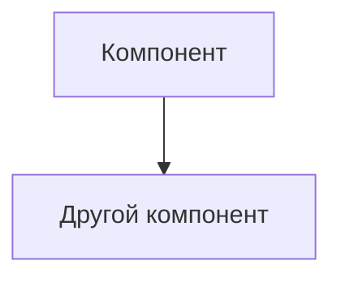

# ADR-<номер>: <Краткое описательное название>

**Статус:** ✅ Принято | ⚠️ На рассмотрении | ❌ Отклонено  
**Участники:** <Имена и роли>  
**Дата:** <ГГГГ-ММ-ДД>  

---

## 1. Контекст
<Опишите проблему или возможность, которые привели к этому решению. Включите технический и бизнес-контекст>

---

## 2. Требования

### Функциональные
<Используйте один из форматов>

**FURPS+**:
| Категория       | Требование                  |
|-----------------|-----------------------------|
| **F**unctional  | <Функциональные возможности>|
| **U**sability   | <Требования к UX/UI>        |

**Или Use Cases**:
| UC-ID | Название | Основной поток | Альтернативные потоки |

### Нефункциональные
| Категория       | Требование                  | Критичность |
|-----------------|-----------------------------|-------------|
| <Производительность> | <Детали>              | <Высокая>   |

---

## 3. Решение

### Описание
<Детальное описание решения с диаграммами при необходимости>

### Аргументация

| Критерий         | Обоснование                 |
|------------------|-----------------------------|
|                  |                             |

#### Последствия

**✅ Положительные:**
- 
- 

**⚠️ Негативные:**
- 
- 

**↗️ Зависимости:**
- 

---

### 4. Альтернативы

| Вариант      | Плюсы                      | Минусы                     | Почему отклонен           |
|--------------|----------------------------|----------------------------|---------------------------|
|              |                            |                            |                           |

---

### 5. Риски

1. **<Название риска>**  
   *Меры:* 

2. **<Название риска>**  
   *Меры:* 

3. **<Название риска>**  
   *Меры:* 